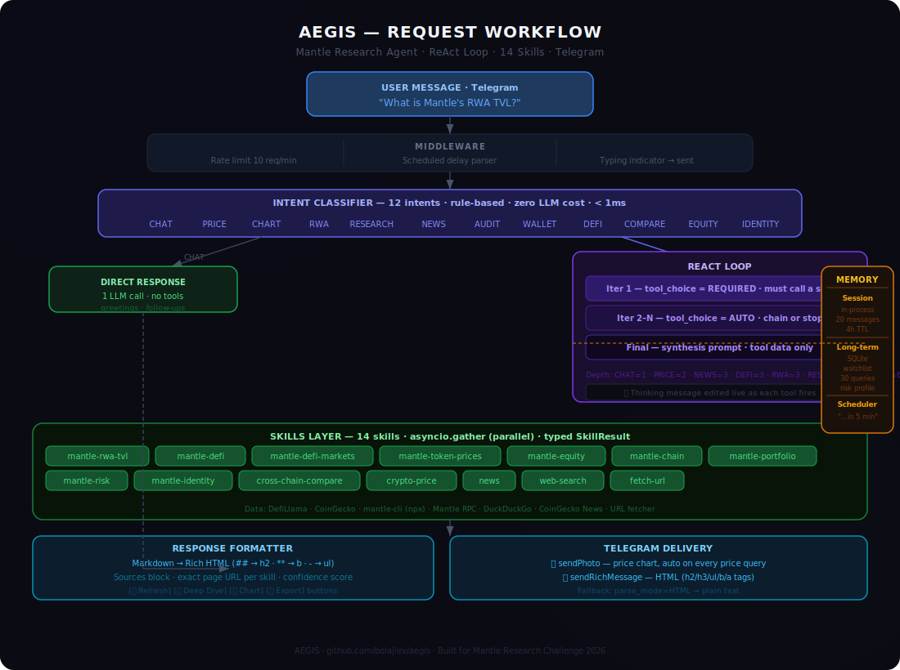

# Aegis — How It Works

Aegis is a **ReAct-loop research agent** for the Mantle ecosystem. Every answer is grounded in live data fetched seconds before you read it. The model is structurally prevented from answering from training memory — it must call a live skill on every research query.

---

## Full Request Flow



---

## Stage 1 — Intent Classification

Before any LLM or API call, a rule-based classifier reads the message and assigns one of **12 intents in under 1ms** — zero model cost, zero latency.

```
"what's MNT price?"         → PRICE    (max 2 iterations)
"deep dive on Ondo finance" → RESEARCH (max 4 iterations)
"is Merchant Moe safe?"     → AUDIT    (max 6 iterations)
"hi"                        → CHAT     (1 call, no tools, instant)
"compare Mantle vs Base"    → COMPARE  (max 4 iterations)
```

**CHAT returns immediately** — greetings, thanks, follow-ups never touch an API.

| Intent | Triggers | Depth |
|---|---|---|
| CHAT | hi, gm, thanks, hey | 1 — no tools |
| PRICE | price, worth, $TOKEN | 2 |
| CHART | chart, graph, 7d | 2 |
| RWA | rwa, tokenized bonds, Ondo, Midas | 3 |
| DEFI | TVL, yield, Merchant Moe, Aave | 3 |
| NEWS | news, latest, what happened | 3 |
| RESEARCH | deep dive, explain, analyze, overview | 4 |
| COMPARE | vs, compare, versus, how does X stack up | 4 |
| AUDIT | safe, rug, risk, red flags, exploit | 6 |
| WALLET | 0x address in message | 3 |
| EQUITY | TSLAx, NVDAx, xStocks | 2 |
| IDENTITY | who are you, ERC-8004, agent ID | 2 |

---

## Stage 2 — The ReAct Loop

**Reason + Act.** The model thinks, calls tools, observes real data, and repeats until confident.

```python
for iteration in range(max_iterations):

    tool_choice = "required" if iteration == 0 else "auto"
    #             ^^^^^^^^
    #    Iter 1: model MUST call a skill.
    #    It cannot write a response yet.
    #    No path to hallucination exists.

    response = llm.chat(messages, tools=14_tools, tool_choice=tool_choice)

    if response.stop_reason == "stop":
        break  # model chose to answer — done

    # All tool calls from this iteration run in parallel
    results = await asyncio.gather(*[
        execute_tool(tc.name, tc.args) for tc in response.tool_calls
    ])

    # Append results to context, loop again
    messages += [tool_result(r) for r in results]

    if iteration == max_iterations - 1:
        # Final iteration — force synthesis
        messages.append("Write your answer using only the tool data above.")
```

### Live progress

As each tool fires, the ⏳ Thinking message is edited in real time:

```
⏳ Researching…

  📋 Checking Mantle RWA TVL
  ⚖️ Comparing chains
  🌐 Searching the web
```

### Why `tool_choice = required` on iteration 1 matters

The system prompt explicitly bans the model from inventing data:

> *Never state a specific APY/rate unless a tool returned it.*
> *Never state 7d change percentages unless a tool returned them.*
> *If data is unavailable: "Data unavailable — [reason]."*

But bans alone aren't enough. `tool_choice = required` is a hard structural guarantee — the model physically cannot produce a response on the first pass. It must return a tool call. **No hallucination path exists.**

---

## Stage 3 — Skills Layer

14 skills run in parallel via `asyncio.gather`. Each returns a typed `SkillResult`:

```python
class SkillResult(BaseModel):
    skill: str
    source: str       # human-readable source name
    source_url: str   # exact data page — shown as tappable link
    data: dict        # live payload
    fetched_at: datetime
    ok: bool
    error: str | None
```

| Skill | Data source | Returns |
|---|---|---|
| `mantle-rwa-tvl` | DefiLlama /protocols | RWA TVL per protocol on Mantle |
| `mantle-defi` | DefiLlama /protocols | DeFi TVL, DEX volume, fees |
| `mantle-defi-markets` | mantle-cli + DefiLlama | Aave V3 rates, top LP pools |
| `mantle-token-prices` | mantle-cli + CoinGecko | MNT, mETH, WMNT, USDT live prices |
| `mantle-equity` | CoinGecko | TSLAx, NVDAx, AAPLx, SPCXx live prices |
| `mantle-chain` | Mantle RPC + mantle-cli | Gas price, block height, chain status |
| `mantle-portfolio` | Mantle RPC + mantle-cli | Wallet balances, Aave positions |
| `mantle-risk` | DefiLlama + web search | TVL trend, audit history, risk verdict |
| `mantle-identity` | Mantle RPC | ERC-8004 agent identity lookup |
| `cross-chain-compare` | DefiLlama /v2/chains | TVL + RWA across 6 EVM chains |
| `crypto-price` | CoinGecko | Price, 24h change, market cap, volume |
| `news` | DuckDuckGo + CoinGecko News | Latest Mantle + Web3 news, deduplicated |
| `web-search` | DuckDuckGo | Open research queries |
| `fetch-url` | HTTP + extraction | Full article or document content |

Every `source_url` is the **exact data page** — `defillama.com/protocol/ondo-finance`, `coingecko.com/en/coins/mantle` — not a homepage. Sources appear as tappable links in the response.

---

## Stage 4 — Response Formatter

The model writes markdown. The formatter converts it to Telegram-native rich HTML before sending:

```
## Section Header   →   <h2>Section Header</h2>
### Sub-header       →   <h3>Sub-header</h3>
**bold**             →   <b>bold</b>
- bullet item        →   <ul><li>bullet item</li></ul>
plain paragraph      →   <p>plain paragraph</p>
```

A **sources block** is appended — each source is a tappable link:

```
📎 Sources
DefiLlama — Mantle protocols  ·  CoinGecko — MNT  ·  fetched 14:47 UTC
✅ 100% data confidence · 3 sources
```

Every response gets **inline action buttons**:

```
[🔄 Refresh]   [🔎 Deep Dive]   [📊 Chart]   [📤 Export]
```

- **Refresh** — re-runs the same query live
- **Deep Dive** — re-runs at full audit depth (6 iterations)
- **Chart** — renders a 7-day price chart for the token in the query
- **Export** — sends the response as `aegis_{query}_{timestamp}.md`

---

## Memory

### Session memory
- Last 20 exchanges per user
- 4-hour TTL, stored in-process
- Enables natural follow-ups: *"what about its TVL?"* → Aegis knows the context

### Long-term memory (SQLite)
Persists across restarts. Per user:
- **Watchlist** — tokens and protocols you've mentioned
- **Research history** — last 30 queries with timestamps
- **Risk profile** — derived from query patterns (`conservative / moderate / degen`)

Injected as context on every call:
```
[User context: Watching: MNT, TSLAx | Recent research: Mantle RWA TVL,
 Merchant Moe | Risk profile: moderate]
```

### Scheduler
Queries like *"check MNT price in 5 minutes"* are stored and fired by a 15-second poll loop. Up to 5 pending tasks per user.

---

## Example: full request trace

```
User:   "How does Mantle compare to Base and Arbitrum on RWA?"

Intent: COMPARE → max 4 iterations

Iter 1: tool_choice=required
        → calls: compare_chains, get_mantle_rwa_tvl  (parallel)
        → compare_chains returns TVL for 6 chains from DefiLlama
        → get_mantle_rwa_tvl returns protocol breakdown on Mantle

Iter 2: tool_choice=auto
        → model reviews data, decides it has enough, stop_reason="stop"

Formatter:
        ## Mantle vs Base vs Arbitrum — RWA Leadership
        ### TVL Comparison
        - Mantle: $150M total TVL
        - Arbitrum: $1.28B total TVL
        - Base: $4.16B total TVL
        ### RWA Breakdown
        - Mantle: $144M RWA (96% of total TVL)
        - Arbitrum: $689M RWA (54% of total TVL)
        - Base: $131M RWA (3.2% of total TVL)
        ### Bottom Line
        Mantle chose RWA as its identity — 96% concentration
        is a product decision, not a coincidence.

Sources: defillama.com/chains · defillama.com/protocols
Buttons: [🔄 Refresh] [🔎 Deep Dive] [📊 Chart] [📤 Export]
```

---

## Running Aegis

```bash
git clone https://github.com/bolajiev/aegis
cd aegis
pip install -r requirements.txt
cp .env.example .env       # fill in TELEGRAM_BOT_TOKEN + QWEN_API_KEY
python3 bot.py             # bot starts polling
pytest -q                  # 28 tests
```

See [README.md](../README.md) for all environment variables and the ERC-8004 registration guide.
